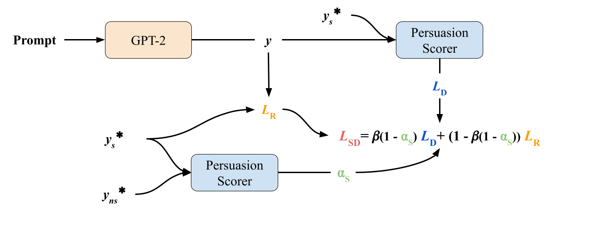

# Style Infusion Repository

This is the source code for our EMNLP submissions. Within this repository are 5 sub-folders:
1. `bayesian_correlations`: this sub-repo is responsible for computing the correlations between a style and linguistic features. 
2. `data_feature_extraction`: this sub-repo is responsible for extracting the linguistic features from given text
3. `style_classifier`: this sub-repo is responsible for training the discriminator and 
4. `style_data_augmentation`: this sub-repo is responsible for our augmentation method
5. `style_infusion`: this sub-repo is responsible for the training of the style-infused generator.

Our repository has many dependencies which are sometimes incompatible so you will have to create multiple conda environments for each sub-repo. Although it is possible to combine a few of these environments, it may lead to issues in certain parts of the code unless otherwise explicitly mentioned. You will also find more detailed instructions in the README.md within each sub-repo.

## Downloading the Data

We utilize the following datasets (all in English):
- UKPConvArg1 corpus (otherwise known as the 16k Persuasive Pairs dataset) which can be found [here](https://github.com/UKPLab/acl2016-convincing-arguments).
- Cornell Movie Quotes Corpus (otherwise known as IMDB dataset )which can be found [here](https://www.cs.cornell.edu/~cristian/memorability.html)
- CNN/DM corpus from [here](https://huggingface.co/datasets/cnn_dailymail)
- (Optional) The r/ChangeMyView Dataset from [here](https://chenhaot.com/pages/changemyview.html)

We support reading from all datasets except the CNN/DM which is handled by the HuggingFace Datasets library. Note that the train/test split was 87.5/12.5 for our experiments.

## Quickstart

For each sub-repo (except for `bayesian_correlations`), we also include a `.sh` file for ease of replication. Note that you may have to change parameters inside the `.sh` file and also pass in the correct location of you data/trained models if you change the structure. 

Also, some of the `README.md` files may mention files that do not exist. This is because they contained information that would violate EMNLP's anonymous submission policy. 

We provide step-by-step instructions as follows:

### Training the Discriminator

You will find detailed instructions on how to train the discriminator in `style_classifier/README.md`. You can also apply this to the IMDB dataset. Note that you should not use any augmented data here as it will decrease the quality of the discriminator.

### Augmenting the Datasets

Follow the instructions in `style_data_augmentation/README.md`. It is possible you will need multiple conda environments, depending on your machine. There is also an `environment.yml` for reference to provide a clearer idea of the versions we used. Note that you should also run `create_dataset.py` to format your dataset correctly for the generator.

### Training the Style-Infused Generator

After creating your dataset and installing the requirements, navigate into the `style_infusion` directory and run:

`deepspeed --num_gpus=<NUM_GPUS> style_generation_trainer.py --batch_size <BATCH> --beta <BETA> --training_data <DATASET> --save_path <SAVE_PATH> --total_steps <TOTAL_STEPS>`

To run evaluation, use:

`python dutils/evaluation.py --model_name <MODEL_NAME> --test_file <TEST_DATA>`

You can see more details in `style_infusion/README.md`.

### Extracting Data Features from Text

Follow the instructions for installation in `data_feature_exctraction/README.md`. You can reuse the environment for the style discriminator. We already include the features and inference for the datasets, so you should only need to run this for generations.

You should store generations in `style_infusion/generations` and then run `data_feature_utils.py` to run the feature extractor.

### Computing Linguistic Feature Correlations

You should install all requirements using `pip install -r requirements.txt` after navigating into the sub-repository. WARNING: numpyro and jax are extremely finnicky, especially on machines with GPUs.

Afterwards, you need to run `main.py` with the following command:

`python main.py <DATASET> <FEATURES_FILE> <INFERENCE_FILE> <SVC_FEATURES_FILE>`

For example:

`python main.py "imdb" data/features.csv data/inference.csv ""`

Note that the SVC features refer to speed, volume, and circuitousness (Toubia et al., 2021). These values were computed with their MATLAB code and you will need to contact the authors for their code as it is not ours to distribute. 

This should produce a correlations file which will show you the individual correlations between a feature and a style.

## Reproducability Checklist

- The model takes approximately 10 hours to run 10,000 steps on 2 V100's with 32 GB of memory (run with DeepSpeed and FP16 training).
- The number of parameters is 110M (bert-base-uncased) + 117M (GPT2) + 768 (FC layer) = ~227M
- There is only one hyperparameter we search (beta) which ranges from 0 to 1. We run trials for 4 values of beta (0.1, 0.5, 0.8, and 1.0).
-
